<h1 align="left">Robin Gerth</h1>
<h3 align="left">Full-Stack Developer · Shopware 6 · Angular · Python</h3>

Ich baue E-Commerce- und Backend-Systeme, aktuell als Full-Stack Developer bei der
ABC Design GmbH in Albbruck. Schwerpunkt: Shopware 6 (PHP/Symfony/Vue), Angular-Frontends
und Python-Services. Daneben beschäftige ich mich mit der praktischen Integration von LLMs
in bestehende Unternehmenssysteme, von RAG-Pipelines bis zu Sprachassistenten.

Deutsch-Schweizer Doppelbürger, wohnhaft in Dogern direkt an der Schweizer Grenze.

📍 Dogern, DE &nbsp;·&nbsp; 🌐 [robin-gerth.de](https://robin-gerth.de) &nbsp;·&nbsp; 💼 [LinkedIn](https://www.linkedin.com/in/robin-gerth-47100031b/) &nbsp;·&nbsp; ✉️ [robingerth21@gmail.com](mailto:robingerth21@gmail.com)

<!--
  Offensivere Variante fuer die aktive Bewerbungsphase, ersetzt den Doppelbuerger-Satz oben:
  Deutsch-Schweizer Doppelbuerger mit Wohnsitz direkt an der Grenze. Offen fuer
  Full-Stack- und AI-Integration-Rollen im Raum Basel und Aargau, ohne Bewilligungsaufwand.
-->

 

---

## Ausgewählte Projekte

### [conduit-container](https://github.com/Gerth123/conduit-container)
Eine Legacy-Anwendung auf Django 1.10.5 ließ sich nicht auf modernem Python betreiben und hatte
keinen reproduzierbaren Deploy-Weg. Ich habe sie vollständig containerisiert: Multi-Stage-Builds
für Backend und Angular-Frontend, automatisierte Kompatibilitäts-Patches während des Builds,
Gunicorn und Whitenoise statt Dev-Server, Nginx mit Fallback für Client-Side-Routing. Eine
GitHub-Actions-Pipeline baut die Images, pusht sie nach GHCR und deployt per SSH auf eine Cloud-VM,
sodass auf dem Zielserver nie gebaut wird.

`Django REST · Angular · PostgreSQL · Docker Compose · GitHub Actions · GHCR · Nginx`

### [voice-agent](https://github.com/Gerth123/voice-agent)
MVP eines KI-Sprachassistenten für eingehende Anrufe, ausgelegt auf EU-Hosting und
Datensparsamkeit. Führt strukturierte Gesprächszusammenfassungen, bucht Termine direkt in
freie Kalenderslots über iCal/CalDAV und meldet sich per WhatsApp. Die Provider für STT, TTS
und LLM sind hinter Adaptern austauschbar, davor liegt eine eigene Privacy-Schicht.
Klare KI-Offenlegung zu Gesprächsbeginn ist fest eingebaut.

`FastAPI · Angular · Alembic · n8n · Docker Compose`

### [Videoflix](https://github.com/Gerth123/Videoflix-Backend)
Streaming-Plattform mit Django-REST-Backend und Angular-Frontend. Video-Uploads werden
asynchron über Django RQ und Redis verarbeitet, Thumbnails per FFmpeg generiert, damit
Requests nicht blockieren. Dazu vollständiger Auth-Flow mit Registrierung, Mail-Aktivierung
und Passwort-Reset. Frontend im
[zugehörigen Repository](https://github.com/Gerth123/Videoflix-Frontend).

`Django REST · Angular · PostgreSQL · Redis · Django RQ · FFmpeg`

---

## Stack

**Backend** &nbsp; PHP · Symfony · Shopware 6 · Python · Django · DRF · FastAPI · Redis / RQ
**Frontend** &nbsp; TypeScript · Angular · Vue · JavaScript · SCSS
**Daten** &nbsp; PostgreSQL · SQLite · Redis
**Infrastruktur** &nbsp; Linux · Docker · Docker Compose · GitHub Actions · Nginx
**Testing** &nbsp; PHPUnit · pytest
**Weiteres** &nbsp; Kotlin (Android) · LLM-Integration · RAG · n8n

  
  
  
  
  
  
  
  
  
  
  
  
  
  
  
  
  
  
  
  
  

---

## Hintergrund

Quereinsteiger mit ungewöhnlichem Weg: drei Jahre Polizeivollzugsdienst in Baden-Württemberg,
Streifendienst und Ermittlungen, davor eine kaufmännische Ausbildung im Elektronikfachhandel.
Den Umstieg in die Entwicklung habe ich berufsbegleitend über eine 21-monatige
Full-Stack-Ausbildung gemacht und arbeite seit Juni 2025 hauptberuflich als Entwickler.

Was ich aus der Zeit davor mitnehme: strukturiertes Vorgehen unter Zeitdruck, saubere
Dokumentation und die Gewohnheit, Sachverhalte zu klären statt anzunehmen.

---

